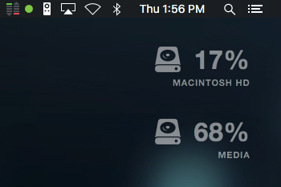

# Simple Übersicht Disk Space Widget

A simple widget to show current occupied space on your primary hard drive. Just something I put together quick. Feel free to contribute and improve.

To enable, place the `hddspace.widget` folder in your `Übersicht/widgets` directory.

###### Todo:
- Show max and occupied space

Get more widgets at [Übersicht][1]!

[1]: http://tracesof.net/uebersicht-widgets/
